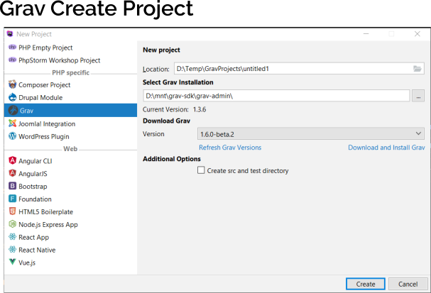
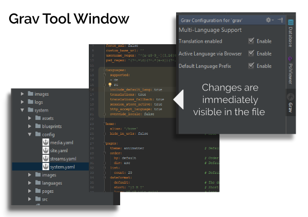
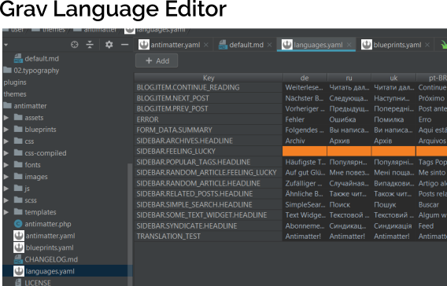

# Grav Support Plugin

[Grav](https://getgrav.org/) is a flat-file open source CMS.
This plugin helps to increase the development speed for Grav-based projects for PhpStorm and IntelliJ IDEA Community / Ultimate.

**Current version:** 0.7.0-SNAPSHOT

**Tested with:**

* PhpStorm 2020.3
* IntelliJ IDEA Ultimate 2020.3

**Releases:** 
The plugin is primarily made available via [JetBrain's Plugin Repository](https://plugins.jetbrains.com/plugin/9971-grav-support).

## Install

### JetBrains Plugins Repository

Open the settings menu <kbd>CTRL+ALT+S</kbd> or **File | Settings** and then go to **Plugins**. Click on the button _
Browse repositories_ and search for
**Grav Support**. This way you will get notified if a new update is available!

### GitHub Releases

[Download the latest plugin](https://github.com/PioBeat/GravSupport/releases) and install it via the settings
menu: <kbd>CTRL+ALT+S</kbd> or **File | Settings**
and then under the category **Plugins**, click on the configuration wheel in the top bar and select **Install Plugin
from Disk...**.

### Requirements

The following requirements must be met in order to use **Grav Support**:

_(basically required if not using PhpStorm or IntelliJ IDEA Ultimate)_

- YAML (already bundled with IntelliJ IDEA)
- (**Required**) [PHP](https://plugins.jetbrains.com/plugin/6610-php)
- (**Required**) [Twig Support](https://plugins.jetbrains.com/plugin/7303-twig-support)
- (**Required**) [PHP Annotations](https://plugins.jetbrains.com/plugin/7320-php-annotations)
- **(Optional)** [PHP Toolbox](https://plugins.jetbrains.com/plugin/8133-php-toolbox)

This plugin supports only IntelliJ IDEA Ultimate or PhpStorm.

**Remark: Supported Versions of PHP and Grav**

This plugin needs a valid PHP installation on the machine. 
PHP should be found in the ``PATH``,

The latest plugin supports the following Grav versions: 1.6.*, ...

The plugin uses the scripts in the ``bin`` directory of Grav to offer the functionality Grav supports via those scripts.

Furthermore, I only provide support for **PHP 7.***.
If you have a lower version than the plugin may not work correctly.
To work with Grav, the PHP extensions `mbstring`, `curl` and `openssl` must be enabled.

## Configuration

If you create a new Grav project you will have all features enabled by default. 
Therefore, a "New Project" wizard for Grav-based projects is provided by the plugin within the IDE.

If you're opening a previously created project (that was not created with the plugin) you may have to enable the plugin for the current project. 
The plugin tries to detect a Grav project automatically and notifies the user accordingly. 
Otherwise, open the Settings menu (<kbd>CTRL+ALT+S</kbd>) and go to **File | Settings | Languages & Frameworks | Grav** and enable the plugin for the current
project.

## Features

(see the changelog for a complete list)

<ul>
    <li>Create a Grav project by using the wizard</li>
    <li>Special language file editor</li>
    <li>Tool window to configure basic config files of Grav</li>
    <li>Navigate to the related template file from a page content markdown file</li>
    <li>Create specific configuration files for a theme in the theme directory
        (<code>blueprints.yaml</code>, <code>THEME_NAME.yaml</code>)</li>
    <li>Recognition of basic Grav configuration files</li>
    <li>Create new theme (Tools menu or context menu on a Grav project)</li>
    <li>Twig intentions</li>
</ul>

## Screenshots








## Common Issues

**Supported Grav versions**

The supported Grav versions are fetched from the GitHub repository of [getgrav](https://github.com/getgrav/grav)
automatically. They can be selected directly in the project wizard of IntelliJ.

Furthermore, it is possible to use any other Grav installation by manually downloading them and specifying the path in
the wizard.

**The Grav plugin does not seem to work on existing projects**

Grav projects that were not created via the project wizard may not be initialized correctly (e.g., module type  is not 'GRAV_TYPE').

A solution is to completely remove the `.idea` folder of the project and re-open it in InteliJ IDEA.
A notification will be displayed which proposes to convert the project to a <i>Grav project</i>.

**"Grav plugin 'devtools' is not installed"**

If you get this error message: "Grav plugin 'devtools' is not installed"
after using the plugin and creating a new theme then you should follow these steps:

Move into your newly created Grav project and type into the console:

```
$ bin/gpm install devtools
```

References:

* [https://learn.getgrav.org/plugins/plugin-tutorial](https://learn.getgrav.org/plugins/plugin-tutorial)
* [https://github.com/getgrav/grav-plugin-devtools](https://github.com/getgrav/grav-plugin-devtools)

## Contribution

Support the plugin if you like it:

- Tell your friends who are using IntelliJ and Grav about this plugin
- Star it at GitHub
- Star it on the [JetBrains Plugins Repository](https://plugins.jetbrains.com/plugin/9971-grav-support)
- Report bugs or feature requests or even fix / implement them
- Reach out to me directly at dominik@offbeat-pioneer.net

### Implementing Features or Fixing Bugs

Fork this repository to your own GitHub account and then clone it to your local device. Open a pull request with
improvements.

Please read
the [IntelliJ Platform SDK Documentation](http://www.jetbrains.org/intellij/sdk/docs/basics/getting_started/setting_up_environment.html)
on how to set up the development environment.

#### Build Configuration

This section provides some hints on how to setup this plugin project.

- Create the file `local.properties` with the following content in the root directory of this project:

```properties
alternativeIdePathTesting=/path/to/your/phpstorm/installation
# alternativeIdePathTesting=C:\\Program Files\\JetBrains\\PhpStorm 2020.3
```

- The `gradle :runIde` task can be started with the following arguments:

```shell
$ gradlew runIde

# this will use the path specified by 'alternativeIdePathTesting' in 'local.properties' 
$ gradlew runIde -PidePhpStorm 
```

### Reporting Bugs

If you find any problematic issues, please report them directly by using
the [GitHub issue tracker](https://github.com/PioBeat/GravSupport/issues) instead of review comments. This also includes
feature requests and enhancements.

**Automatic Bug Reports**

The plugin offers the possibility to report errors directly within the IDE. If an exception occurs, the user can submit
the error by the error reporting feature of IntelliJ. After, the bug report will be added automatically to this
repository as an
issue: [https://github.com/Grav-IntelliJ-Plugin/GravSupport-Plugin-BugTracker/issues](https://github.com/Grav-IntelliJ-Plugin/GravSupport-Plugin-BugTracker/issues)
.


